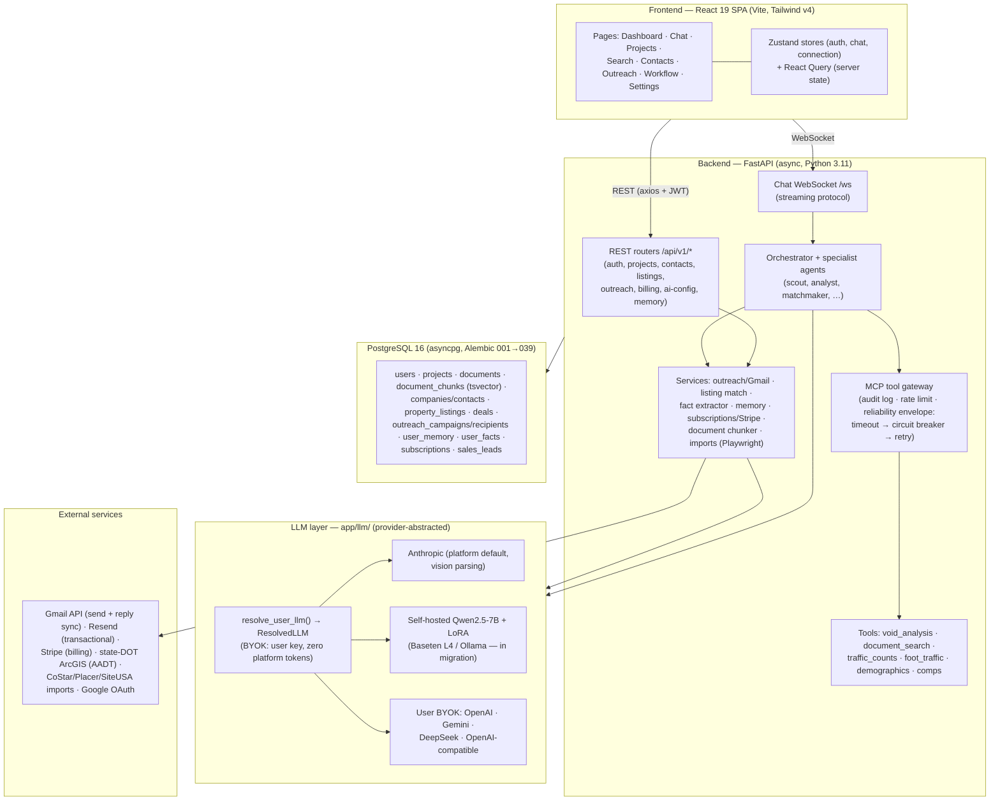
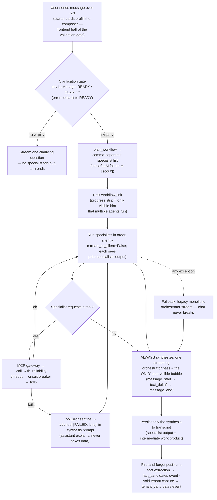
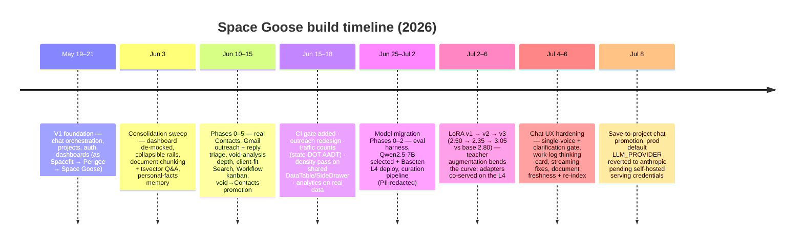

# Space Goose — App Design & History

A single-document overview of what this app is, how it's put together, how a chat turn flows
through the system, and the design decisions and history that shaped it. Companion docs:
`CLAUDE.md` (working conventions), `MIGRATION.md` (model-migration decision record D1–D21),
`ROADMAP.md` (feature status), `frontend/DESIGN.md` (visual canon).

---

## 1. What the app is

**Space Goose** (`spacegoose.ai`) is an AI-driven commercial real estate workbench for brokers.
The core motion is conversational: the user talks to a single "Space Goose Assistant" that can
analyze properties, run tenant void analyses, score listings against a client's buy-box, pull
demographics and traffic counts, and draft outreach in the user's voice. Dashboards, a contacts
directory, a deal kanban, and an outreach suite exist around the chat — but **the chat is the
product**, and everything else is an on-ramp into or off-ramp out of it.

The "spine" of the product is a single loop:

> analyze a property → surface tenant/client fits → save fits as Contacts → launch outreach →
> triage replies → track the deal on the workflow board.

**Stack:** React 19 + TypeScript + Vite 7 + Tailwind v4 SPA (`frontend/`), FastAPI + Python 3.11 +
SQLAlchemy 2.0 async + PostgreSQL 16 (`backend/`), deployed on Render (`render.yaml`), local dev
via `docker-compose.yml`. LLM access is provider-abstracted (`app/llm/`) across Anthropic, OpenAI,
Gemini, DeepSeek, and any OpenAI-compatible endpoint — which is the seam the in-progress migration
to a self-hosted fine-tuned Qwen2.5-7B rides on.

---

## 2. System architecture

---

## 3. Flow chart — one chat turn (specialist routing)

Supporting flows around the chat:

- **BYOK resolution** — every LLM call threads a `ResolvedLLM`; when `is_byok=True` the user's own
  key serves the whole turn (including the guardrail classifier) and platform token counters stay
  flat — a verifiable zero-platform-tokens guarantee (`scripts/byok_verify.py`).
- **Document Q&A** — uploads are parsed, then chunked page-aware into `document_chunks` with a
  generated `tsvector` column; the `document_search` tool returns ranked hits with
  `[source:doc:page]` citations.
- **Outreach transport** — campaign send picks Gmail OAuth → SMTP → dev-log, with open/click
  tracking applied before transport selection so it works on every path.

---

## 4. Design decisions (the short list)

**Product & UX**

1. **Chat-first, single voice.** Specialists (scout, analyst, matchmaker, …) run silently behind
   an orchestrator; the user sees exactly one "Space Goose Assistant" bubble per turn. The progress
   strip is the only hint of multi-agent work. Enforced by tests — orchestration is an
   implementation detail, not a persona show.
2. **No mock data, anywhere.** Every number, badge, and row must trace to a real API response;
   missing data gets an honest placeholder (e.g. the dashboard `PipelinePlaceholder`), never a
   seeded fake. This rule progressively killed the mock Contacts, Search grid, Workflow board,
   Analytics, and dashboard pipeline/glance tiles.
3. **Two-layer input validation.** Starter cards prefill the composer instead of sending bare
   titles (frontend), and a cheap LLM clarification gate short-circuits vague turns before any
   specialist fan-out (backend) — better answers and cheaper turns.
4. **Quiet-first design system.** One monolithic `index.css` theme (Tailwind v4 tokens, CSS
   variables, light/dark); mascots are rule-governed (empty states and onboarding yes, data
   surfaces no). The Spacefit→Space Goose rebrand swapped tokens, not class names — the
   `-industrial` classes are intentionally legacy.
5. **Onboarding is a gate + cards, not a wizard.** The 4-step wizard (3 steps non-functional) was
   deleted for a one-click `/welcome` page plus dismissible dashboard setup cards driven by live
   hooks.
6. **Dashboard = outreach triage, not analytics.** Replies sort ahead of follow-ups (a human reply
   is the freshest signal); project stages are derived from real docs/chats/campaigns, replacing a
   "vibe-number" progress bar.

**Backend & platform**

7. **BYOK zero-platform-tokens guarantee.** Users bring their own frontier-model key; when active,
   *every* call in the turn (orchestrator, specialists, guardrails, fact extraction) uses their
   client and platform usage recording is skipped. Any new LLM path must accept `resolved_llm`.
8. **All tools go through the MCP gateway** with a reliability envelope (per-tool timeout →
   circuit breaker → bounded retry). Failures surface as typed errors the assistant explains —
   it never pretends a tool worked, and never fabricates a number a tool couldn't provide.
9. **Enum columns are VARCHAR, not native PG enums** (`native_enum=False`), because the early
   migrations created them as VARCHAR — consistency here prevents a class of asyncpg 500s.
   Fix-forward migrations only; committed migrations are never edited.
10. **Server state lives in React Query, cross-cutting client state in Zustand** — no duplication;
    refetch-on-focus stays off (it once caused a request storm against a cold backend).
11. **Auth state is split across two localStorage keys and must be wiped together** (raw JWTs +
    zustand persist), or the app ping-pongs between login and dashboard — every auth-failure
    handler clears both.
12. **Free public data over paid APIs where it's credible.** Traffic counts come from state-DOT
    ArcGIS AADT layers behind a provider abstraction (no key, no upload) — and return `None`
    rather than a fabricated count when uncovered.

**Model strategy (MIGRATION.md D1–D21)**

13. **The model is an advisor, not a tool-picker.** The fine-tune targets broker-voiced
    pursue-vs-pass reasoning over a property + book of business; tool-calling is necessary but not
    the value.
14. **Eval before, during, and after.** A two-dimension harness (tool-calling accuracy ≥90% +
    LLM-as-judge advisory quality) baselines every candidate on equal footing; base Qwen2.5-7B
    cleared tools (92.9%) but scored 2.80/5 advisory vs Haiku's 4.35 — so base never ships.
15. **Diagnose before you fine-tune.** The gap was classified as voice/format/disposition, not a
    reasoning ceiling → LoRA-fixable (a 14B fallback is documented as D18 but not expected).
16. **Human gold teaches voice; teacher-scale data teaches the mapping.** LoRA v1/v2 on ~29
    human-gold memo pairs scored *below* base (2.50, 2.35); v3 added 110 label-blind
    Claude-teacher pairs and hit 3.05 — first adapter above base. Read deltas, not absolutes:
    the teacher is also the judge.
17. **Train-venue ≠ serve-venue, by design.** Train LoRA on Together AI, serve base + all adapters
    on one Baseten L4 (vLLM `--enable-lora`), with Ollama on a Mac Mini as the local alternative —
    all through the same `openai_compatible` seam, no code changes.
18. **Client-derived data never gets committed.** The curation pipeline redacts PII and client
    identity; datasets are git-ignored; eval holds out whole deals to prevent leakage.

---

## 5. History — how it got here

Narrative version:

1. **V1 (mid-May).** The core workbench shipped under the original name: chat with an
   orchestrator, projects with document parsing, auth/OAuth, subscriptions, dashboards — but
   several surfaces (Contacts, Search, Workflow, Analytics, dashboard pipeline) were mock-driven.
2. **The honesty pass (early June).** The "no mock data" rule was adopted and the dashboard was
   consolidated around outreach triage. Document chunking + full-text search made project chat
   actually quote documents. The memory system gained user-approved personal facts.
3. **Phases 1–5 (mid-June).** The spine was connected end-to-end: a real Contacts directory with
   client buy-boxes, Gmail-backed campaign send with tracking and reply triage, deeper void
   analysis with demographic scrubbing, the LLM-scored client-fit Search matcher, the real deals
   kanban, and one-click promotion of void-analysis tenants into Contacts. CI (tsc + pytest
   against real Postgres) became a hard gate.
4. **Enrichment + polish (late June).** Traffic counts from free state-DOT data, a Placer.ai
   foot-traffic tool, a density/design pass introducing shared `DataTable`/`FilterBar`/`SideDrawer`
   primitives, and analytics rebuilt on real pipeline data. (Also a lesson in restraint: a Search
   redesign was rolled back to the prior layout.)
5. **The model migration (late June → July, in progress).** Evals first, then model selection
   (Qwen2.5-7B on an L4), then data curation, then three LoRA rounds — with v3's teacher
   augmentation the first to beat base. Base + all adapters co-serve on one GPU; prod stays on
   Anthropic until serving credentials/Ollama are finalized.
6. **Chat experience hardening (July).** Single-assistant-voice + clarification gate landed as the
   contract; the thinking-indicator work-log card replaced the agent status strip; a long tail of
   streaming, transcript-legibility, and provider-error fixes; document freshness badges with
   re-indexing; and save-to-project chat promotion.
